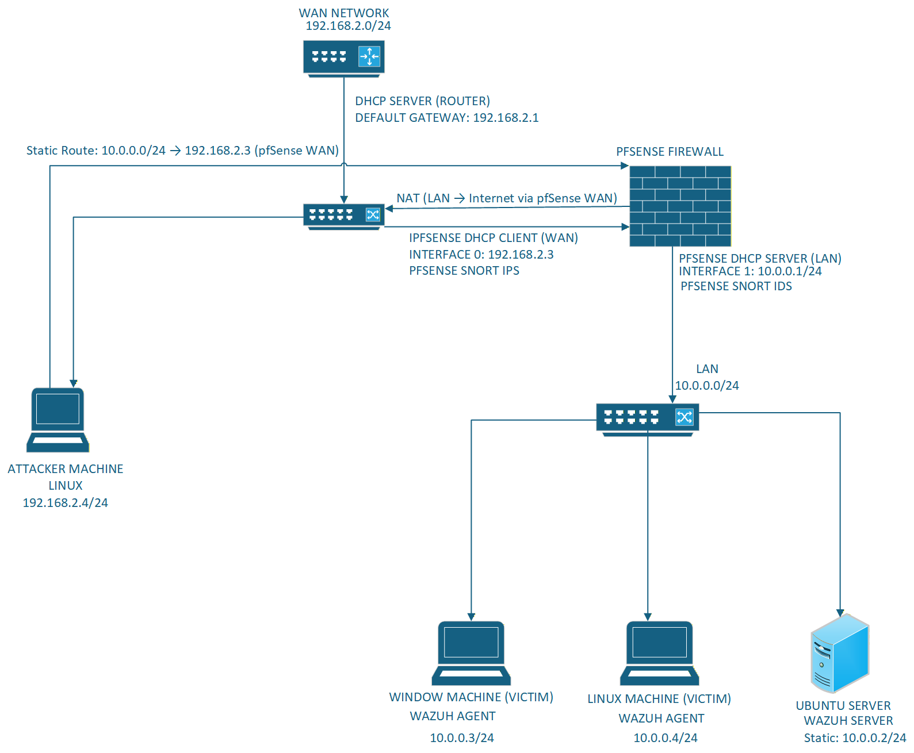

Home Lab Setup for Network Security
Lab Architecture

Components
Linux WAN (Attacker Machine)

IP: 192.168.2.4
Kali Linux machine on the WAN network, used to simulate attacks against the internal network.

pfSense WAN

IP: 192.168.2.3 (DHCP Client)
WAN interface of the pfSense firewall, connecting the LAN network to the WAN using NAT.

pfSense LAN

IP: 10.0.0.1 (DHCP Server / Default Gateway)
LAN interface of the pfSense firewall, connecting all internal devices to the network.

Ubuntu Server (Wazuh Server)

IP: 10.0.0.2 (Static)
Central SIEM server responsible for managing, collecting and correlating security events from all agents.

Linux Machine (Victim and Agent)

IP: 10.0.0.4
Linux endpoint on the internal network, acting as a Wazuh agent and a target machine for simulated attacks.

Windows Machine (Victim and Agent)

IP: 10.0.0.3
Windows endpoint on the internal network, acting as a Wazuh agent and a target machine for simulated attacks.

Tools & Technologies
Snort
Network Intrusion Detection and Prevention System (NIDS/NIPS) running on the pfSense WAN and LAN interfaces to inspect incoming and outgoing traffic for malicious activity.
pfSense
Open-source firewall and router used to segment the WAN and LAN networks and control traffic flow between them. Acts as the main security boundary between the attacker and the internal network.
Wazuh
Open-source SIEM and XDR platform deployed on the Ubuntu Server to collect, centralize and correlate logs from the Windows and Linux agents for threat detection and investigation.
Wireshark
Network protocol analyzer used on endpoint machines to capture and investigate network traffic during simulated attacks.

Network Design
WAN Network — 192.168.2.0/24
Simulates the internet. The attacker machine (Kali Linux) lives here, representing an external threat actor attempting to breach the internal network.
LAN Network — 10.0.0.0/24
Simulates an internal enterprise network. All victim machines and the Wazuh server live here, protected by pfSense.
pfSense sits between both networks, acting as the firewall and router. Snort runs on the WAN interface to detect and prevent threats before they reach the LAN. Wazuh monitors all activity inside the LAN through agents installed on each endpoint.

Purpose
The purpose of this lab is to simulate a real enterprise network environment where common attacks such as Nmap scans, brute force, suspicious logins and DoS attacks are performed and detected.
This lab was built to develop hands-on skills relevant to a SOC Analyst role — specifically in threat detection, log analysis, firewall management and incident investigation.

Skills Practiced

Firewall configuration and traffic rule management (pfSense)
Network intrusion detection and Snort rule configuration
SIEM deployment and Wazuh agent setup
Log collection, correlation and alert triage
Simulating attacks and analyzing detection results
Network segmentation and lab isolation
